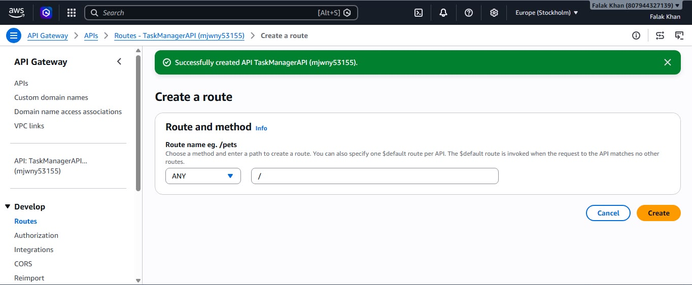
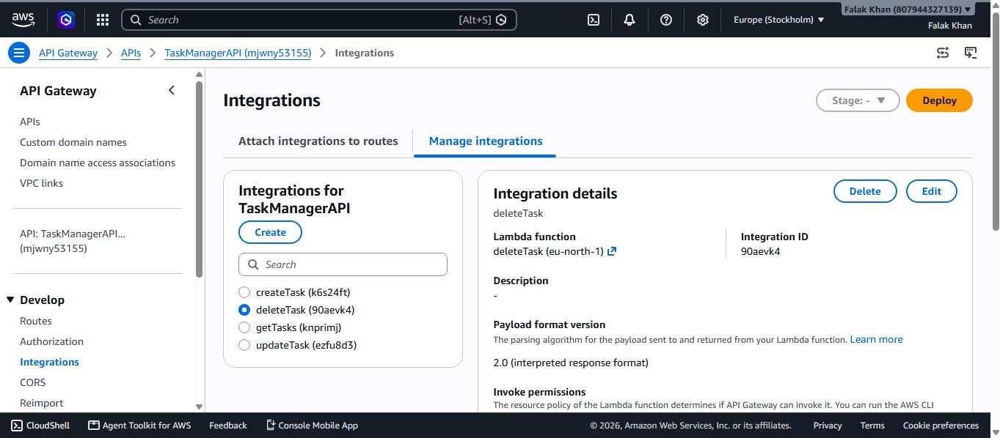
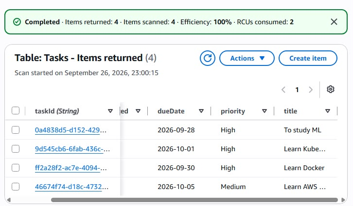
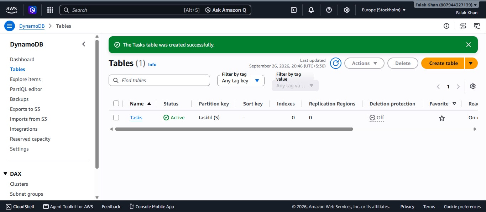
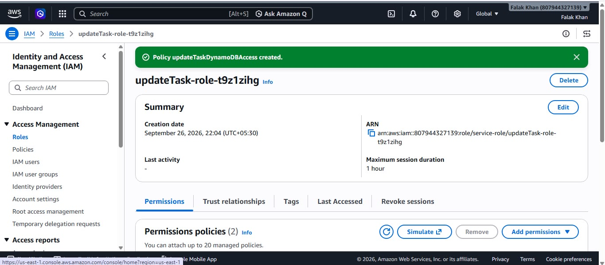
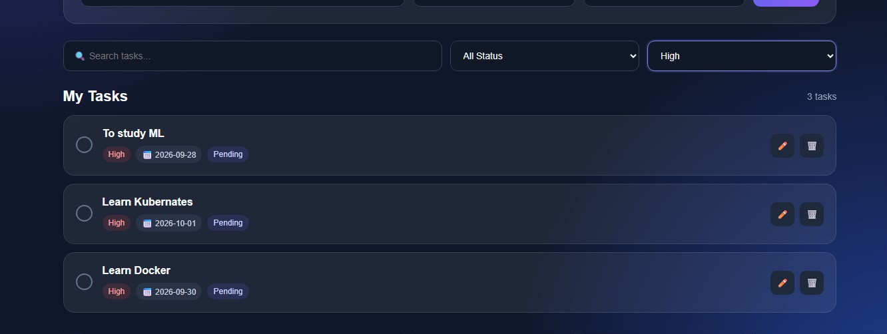

# Serverless Application

## Overview

As part of my AWS hands-on learning, I built a serverless task management application using AWS services.

This project helped me understand how multiple AWS services can work together to build a backend without managing traditional servers.

## Technologies Used

* AWS Lambda
* Amazon API Gateway
* Amazon DynamoDB
* AWS IAM
* Amazon CloudWatch
* React
* Python

## Architecture

```text
React Frontend
       ↓
API Gateway
       ↓
AWS Lambda
       ↓
DynamoDB
       ↓
CloudWatch
```

## AWS Services Used

### AWS Lambda

AWS Lambda was used to run the backend logic for the application.

I created multiple Python Lambda functions to handle different task operations.


Additional Lambda function configurations are included in the screenshots folder.

### Amazon API Gateway

Amazon API Gateway was used to create HTTP API routes and connect the frontend with the Lambda backend.

The application used API routes for creating, retrieving, updating, and deleting tasks.






### Amazon DynamoDB

Amazon DynamoDB was used to store the task information.

The `Tasks` table used `taskId` as the partition key.





### AWS IAM

AWS IAM was used to manage permissions required by the Lambda functions to access AWS resources.



### Amazon CloudWatch

Amazon CloudWatch was used to view Lambda execution logs and monitor the backend functions.

## API Routes

The application used the following API routes:

```text
POST   /tasks
GET    /tasks
PUT    /tasks/{taskId}
DELETE /tasks/{taskId}
```

## Application Features

The application supports basic task management operations such as:

* Adding tasks
* Viewing tasks
* Updating tasks
* Deleting tasks



## Hands-on AWS Work

Through this project, I practiced:

* Creating and configuring AWS Lambda functions
* Writing Python Lambda functions
* Creating HTTP APIs using API Gateway
* Connecting API Gateway with Lambda
* Creating and using DynamoDB tables
* Configuring IAM permissions
* Testing API routes
* Viewing Lambda execution logs using CloudWatch
* Connecting a React frontend with an AWS backend

## Evidence

The `Screenshots` folder contains evidence of my hands-on work during the project.

The screenshots include:

* API Gateway creation and configuration
* API routes
* API Gateway and Lambda integration
* Lambda functions
* DynamoDB table creation
* DynamoDB table
* IAM configuration
* Application features and interface

Other screenshots and configuration details are available in the `Screenshots` folder.

## What I Learned

This project helped me understand how serverless applications are built using AWS services.

I learned how API Gateway, Lambda, DynamoDB, IAM, and CloudWatch can work together to provide an application backend without managing traditional servers.

I also gained hands-on experience connecting a React frontend with AWS backend services and working with APIs, serverless functions, databases, permissions, and monitoring.
